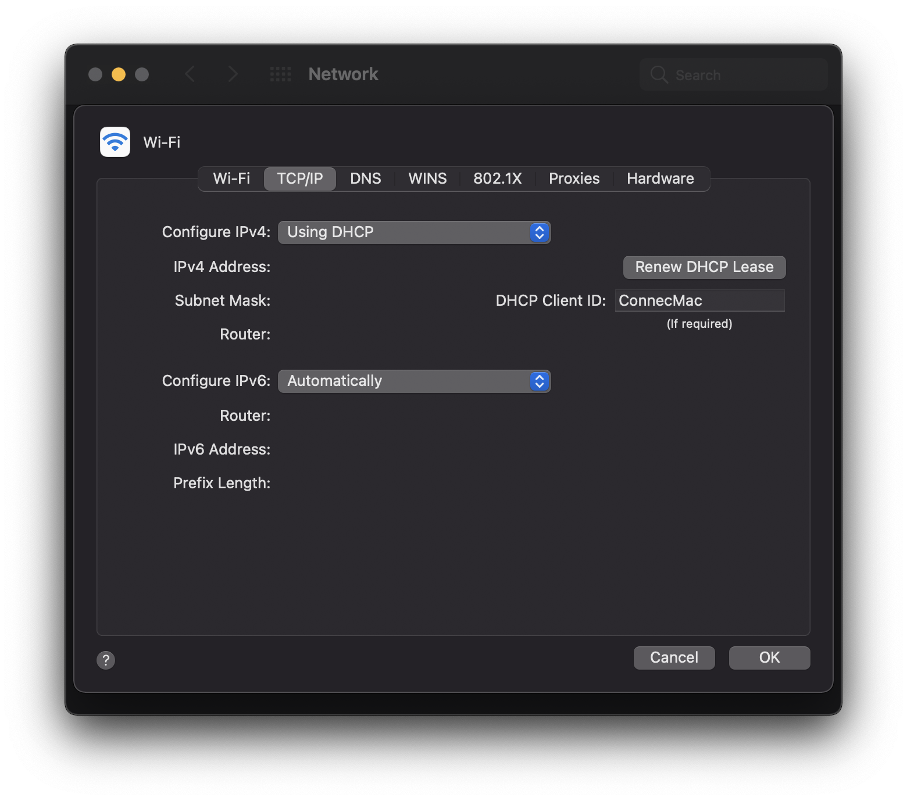

date: "2020-11-24"
title: "Fix Mac not having internet access on wake"
featuredImage: ./media/renew-dhcp-lease.png
---

For the past few months, I've been dealing with an issue on my MacBook Pro where although it wakes up connected to Wi-Fi, it's not able to access the internet. The workaround of disconnecting from the Wi-Fi network and reconnecting is quite time-consuming and was slowly driving me insane as I began using the affected machine more frequently.

After multiple sessions of trying to address this issue, I'm happy to share the solution that worked for me.

1. Go to System Preference → Network
2. Select 'Advanced...' in the bottom right corner
3. Go to the TCP/IP tab
4. Enter 'ConnecMac' in the DHCP Client ID field
5. Select 'Renew DHCP Lease' above the field
6. Press OK
7. In the System Preferences → Network, select the Location dropdown
8. Select 'Edit Locations...'
9. Select the plus sign to add a new location
10. Enter 'Home' as its name

After doing the steps above, my Mac finally started waking up connected to Wi-Fi _with_ internet access again!

In case the above steps don't address this issue for you, here are some other solutions I tried:

- [Reset NVRAM or PRAM on your Mac](https://support.apple.com/en-us/HT204063)
- [How to reset the SMC of your Mac](https://support.apple.com/en-gb/HT201295)
- [If your Mac doesn't connect to the Internet over Wi-Fi](https://support.apple.com/en-us/HT202663)

Let me know what worked for you, you can reach me [@iAligator](https://twitter.com/iAligator) on Twitter.
