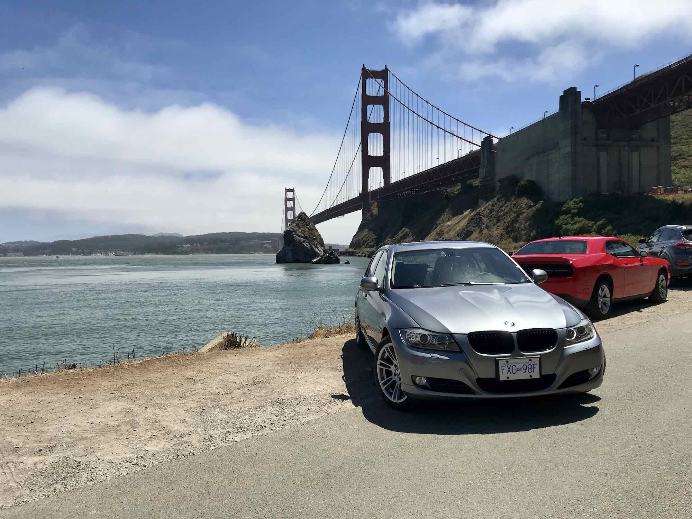
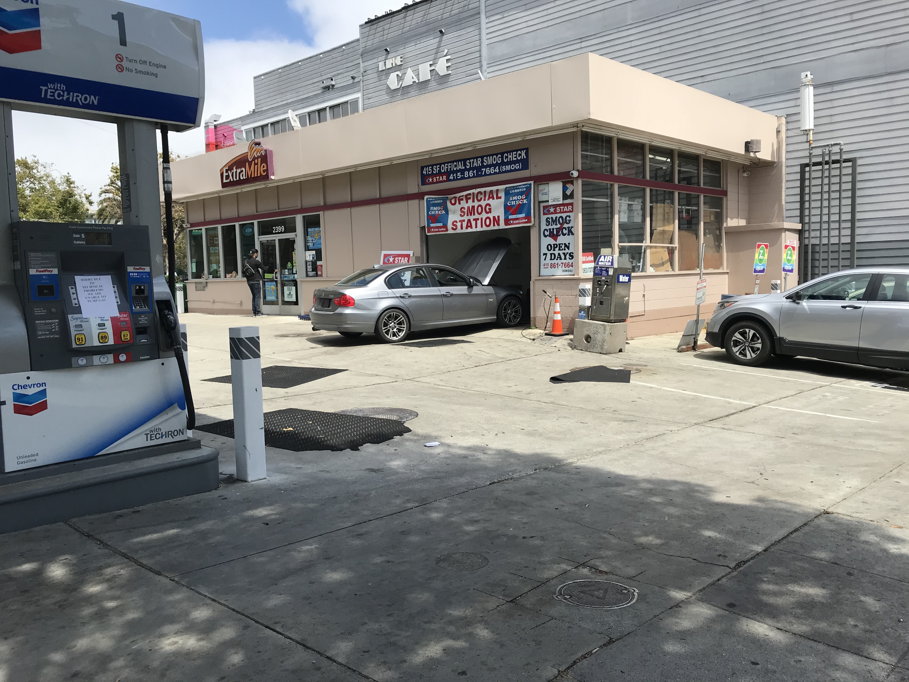

It recently came time to renew my car's California registration, meaning it's been about a year since I imported it to the US from Canada and registered it in California. There were some doubts in my mind both when making the decision to import my car and while going through the process itself. I'm writing this post to hopefully help others considering importing their car to the US from Canada better understand what the process entails and assess whether it's right for them.

#### Getting rid of your Canadian plates (optional)
Prior to driving down to San Francisco, I gave up my BC plates to ICBC and purchased a [temporary operation permit](https://www.icbc.com/insurance/buy-renew-cancel/Pages/buy-or-renew.aspx). This meant having no plates and only two slips of paper under my windshield and rear window for the trip down from Vancouver. This was fine for the entire duration of the trip, including crossing the border, except for one instance where someone pulled up beside me on the interstate to let me know I had no plates, expecting me to find news the piece of information they'd bestowed upon me.

I only returned my BC plates to ICBC to get a refund for the remaining, unused registration that was previously paid for. Depending on how important your BC plates are to you, you can _technically_ choose to keep them beyond their expiration. It's also important to note here that BC is a bit of an (unfortunate) anomaly in having insurance and registration tied together. Your experience with this part will likely vary depending on the Canadian province or territory your car is registered in.

#### Documents for import to the US
There were 3 main documents I had to acquire and complete in preparation for the import:
 - DOT Form H7
 - EPA Form 3520-1
 - Letter of compliance from the manufacturer

As stated on [EPA's website](https://www.epa.gov/importing-vehicles-and-engines/importing-canadian-vehicles), the letter of compliance is only necessary if your vehicle does not have an EPA vehicle emissions label. If you're unable to find the EPA sticker on your car (not common for cars manufactured outside of the US), you can reach out to the [manufacturer's US representative](https://www.epa.gov/importing-vehicles-and-engines/light-duty-vehicle-and-motorcycle-manufacturers-united-states) to get a letter of compliance. This is a straightforward process for cars that are also sold in the US market. If applicable, the manufacturer may also help you transfer the car's warranty to the US.

#### Crossing the border
When crossing into the US through Blaine, I let the CBP officer know that in addition to getting my work visa, I would also be importing my car. Once I'd gotten the stamp for my work visa, the process for importing the car did not take long.

After spending about 15 minutes trying to get into the wrong car, my car was briefly inspected by a CBP officer who had some concerns about the car not having an mph speedometer. I'd coded my car to have the option of showing a digital speedometer a few weeks prior and the digital speedometer was toggleable between km/h and mph. I showed her the digital speedometer reading mph and that was thankfully enough. Upon paying a 2.5% tariff based on Kelly Blue Book's appraisal of my car, I got a letter that stated my car was imported into the US and I continued the drive south!

#### Registering in California
A few days after arrival in San Francisco, I purchased insurance online which was quite simple and not at all dependent on the car being registered in California. As the temporary operation permit was expiring, I got my car smog checked ($35USD) and went to the DMV to register it.

At the DMV, I traded in the most recent ICBC title transfer document for a California Vehicle Title and paid $221USD to get California plates and register the car for a year. I put on the plates in the DMV parking lot and my car was officially a California car!

Over the next few weeks, I received the permanent title and registration papers in the mail to replace the temporary ones I'd gotten at the DMV.

#### Conclusion
Overall, importing the car was relatively simple and not as big of a burden as I'd expected. For me, it was definitely worth doing in order to keep a car I really liked, get the chance to do the drive from Vancouver to SF again, and to have a car immediately upon moving to a new city.

Happy driving! If you have any questions, reach out on Twitter [@iAligator](https://twitter.com/iAligator).
