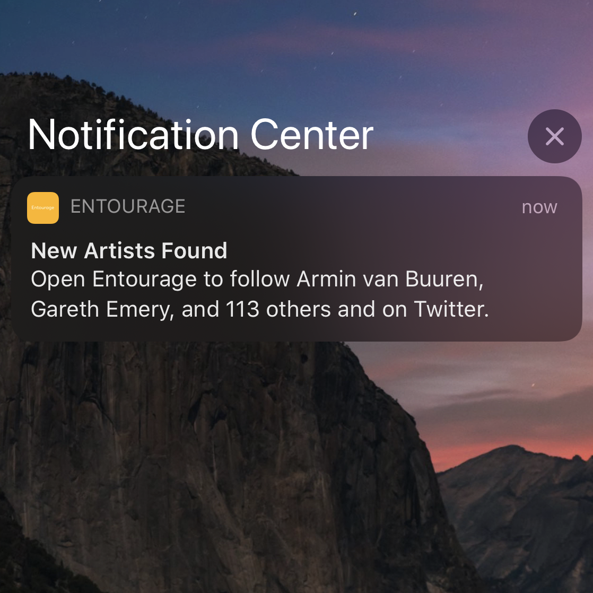

In this post, I’ll cover how to periodically run a task in the background that can send push
notifications to the user on iOS and Android using React Native — all locally on the device
without the need for a server. This guide leverages the follow modules:
- [react-native-background-fetch](https://github.com/transistorsoft/react-native-background-fetch)
- [react-native-push-notification](https://github.com/zo0r/react-native-push-notification)

>This approach may not be appropriate if your push notifications are time-sensitive as iOS
>treats the desired fetch interval as a maximum (i.e. at most it will run every x minutes)
>and provides no minimum guarantee for how frequently the background task runs.


I used this implementation in [Entourage](https://apps.apple.com/us/app/entourage-follow-artists/id1504576202)
to periodically run a background task that fetches results from an API and sends a push notification.

### Setup
Carefully follow the installation steps for both [react-native-background-fetch](https://github.com/transistorsoft/react-native-background-fetch#installing-the-plugin)
and [react-native-push-notification](https://github.com/zo0r/react-native-push-notification#installation).

### Implementation
>Though in this example all the code lives in the component for simplicity, it is
>recommended that you extract these as functions to minimize unnecessary code in the
>component.

In your App.js or component of choice, make the following changes as demonstrated in the code
snippet:
1. Import the two modules.
2. Add useEffect hook in the snippet (this hook mimics the behaviour of componentDidMount).
3. Insert the code you want to run periodically in the background inside
BackgroundFetch.configure. This task will have up to 30 seconds to finish.
4. Send a local push notification inside the code for your task.

```javascript
import React, {useEffect} from 'react';

// 1. Import the modules.
import BackgroundFetch from 'react-native-background-fetch';
import PushNotification from 'react-native-push-notification';

const App = () => {
  // 2. Add the following useEffect hook.
  useEffect(() => {
    // Push notifications setup (recommend extracting into separate file)
    PushNotification.configure({
      // onNotification is called when a notification is to be emitted
      onNotification: notification => console.log(notification),

      // Permissions to register for iOS
      permissions: {
        alert: true,
        badge: true,
        sound: true,
      },
      popInitialNotification: true,
    });

    // Background fetch setup (recommend extracting into separate file)
    BackgroundFetch.configure(
      {
        minimumFetchInterval: 15, // fetch interval in minutes
      },
      async taskId => {
        console.log('Received background-fetch event: ', taskId);

        // 3. Insert code you want to run in the background, for example:
        const outsideTemperature = await getTemperatureInCelsius();

        if (outsideTemperature <= 0) {
          // 4. Send a push notification
          PushNotification.localNotification({
            title: 'Cold Weather Alert',
            message: `It's ${outsideTemperature} degrees outside.`,
            playSound: true,
            soundName: 'default',
          });
        }
        
        // Call finish upon completion of the background task
        BackgroundFetch.finish(taskId);
      },
      error => {
        console.error('RNBackgroundFetch failed to start.');
      },
    );
  }, []);
};
```
Note that with iOS, you’ll need to test the push notifications on a real device as they do
not currently work in the Simulator.

That’s all! Hope this helped you build something.

You can follow me on Twitter [@iAligator](https://twitter.com/iAligator).
