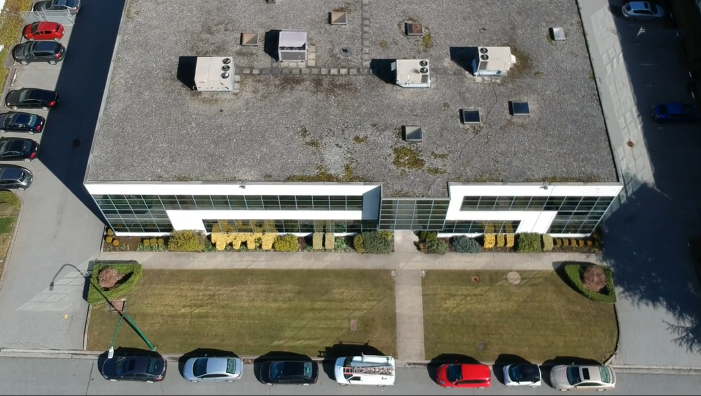
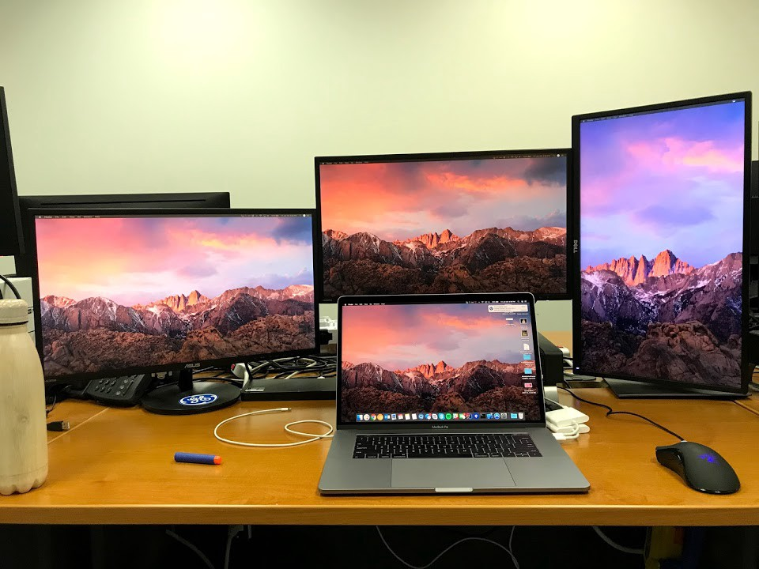
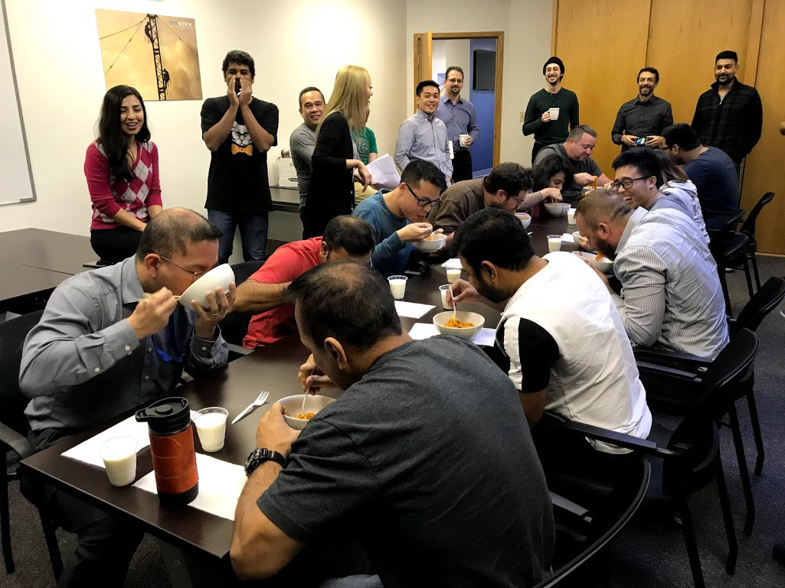
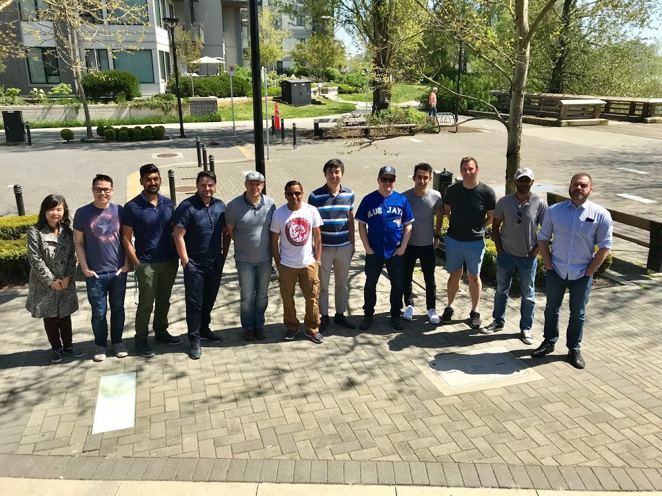

Last Friday brought my 8-month internship (co-op?) at GE Digital in Burnaby, BC to an end.
Given the bit of extra time I have now, I thought I’d sit down and reflect on my time there
while it’s still relatively fresh in my mind. There are a lot of different aspects of my work
experience to cover but with this post, I’ll mostly be focusing on how I started at GE Digital
and what I worked on during my time there.

#### Application and Interview Process
I did some digging in my email and found out when and how I actually applied for the position:
June 29, 2017 through the [GE Careers](https://www.ge.com/careers/) website. Following that, I
was reached out to for a 45-minute interview that we scheduled for July 17, 2017 through WebEx.

I was interviewed by two of my soon-to-be teammates, both software engineers on the App Engine
team. The interview itself was pretty straightforward: the technical portion consisted of a
design problem (create a parking lot tracking system) and an algorithm question
(string-related). There was also some time allocated to behavioural questions, discussing my
experience, and for me to ask questions.

Overall it was a very pleasant and positive experience. Within an hour of finishing the
interview, I found out the feeling was mutual as I got a call from the Director of
Engineering letting me know that they’ll be extending an offer. This was before I even
got to send a thank you email! This happened so quickly probably because I had an upcoming
offer deadline — an actual offer with details (something the call did not include) came a
week later from GE University Relations. Nonetheless, I knew these were people I’d want to
work with and learn from by the end of the two interactions.

#### The First Half

GE Digital Burnaby office building. Shot on DJI Spark. March 9, 2018.

For the sake of this post, I will write about my internship in two halves (September-December
and January-April). This split also makes sense since my focus shifted between the two halves.

My first week consisted of on-boarding, GE training, meeting the team, and setting up and
familiarizing myself with the dev environment. What I especially liked about the on-boarding
process was that throughout it, I was encouraged and empowered to make changes to improve it
for future new-hires. My second week was dedicated to Predix training. The online training’s
primary audience is users looking to become more familiar with all the possibilities in
Predix Studio and App Engine but as a new-hire, it helped me get an outsider’s perspective
on the platform I’d be developing for.

By my third week, I was picking up bite-sized tasks from the team’s backlog. With every
ticket, I was able to get a big-picture overview and an outline of how to begin from a
teammate which really helped ramp me up in the remainder of my first month at the company.
As I progressed, I started working on larger tasks and expanding my knowledge of the various
areas of the platform. I worked on security, the build system, testing, and plugins.

What I enjoyed most about the first half of my internship was the breadth of knowledge I
gained by working on different components of the platform and how willing my teammates were
in educating me on areas I had no prior experience with — whether that was by explaining it
themselves or referring me to the appropriate people and resources.

#### The Final Half

My ever-changing setup at work, this one I’d settled on for almost all of January. Featuring
a Nerf bullet from a recent battle. January 26, 2018.

With the start of January, my focus shifted to application distribution. I’d heard talks of
this feature months before engineering work actually began on it and had expressed my
interest in working on it early on.

When the time finally came, the team I was primarily working with on this feature consisted
of 3 of us, a subset of the App Engine team. We began with the planning stage of the SDLC
which also involved a product manager: understanding the use cases, the definition of an
application, the user flows, and how our piece would fit into the bigger Predix puzzle.
Stories were made and sprints were planned. We iterated on a proof of concept with every
sprint, collecting feedback from the rest of the team, product, and UX.

Despite my focus being narrowed to mainly one feature in the second half of my internship,
I was still doing full-stack development and gaining experience in various areas of software
development which I really valued. The code I wrote was fairly evenly split between front-end
(JavaScript, jQuery) and back-end (MIx, a proprietary language we used based on Java with XML
syntax).

By early April, we had a completed product which had come a long way since we started off in
January. I took on the task of writing user documentation for the end-to-end process (which
also doubled as my co-op report for university). Through this, I was able to poke holes and
point out the subtle details in the end-to-end process. Things like inconsistent parameter
naming, uncertainty in order of completion for the user, and what-if’s for various possible
edge cases.

#### Office Culture
Prior to [being acquired by GE Digital](https://www.theglobeandmail.com/technology/general-electric-buys-vancouver-startup-bit-stew-for-153-million/article32841507/)
in November 2016, the office I worked at was Bit Stew Systems, a Vancouver-based tech startup.
This is an important detail to point out as the office’s culture is still influenced by those
days and continues to feel like a startup (in a good way). It’s a very laid-back environment
to get things done in with flexible hours and the ability to work from home as needed (although
you want to be in the office to improve your ping pong game — I got so much better over the
8 months).

Office spicy ramen challenge. November 23, 2017.

There are only a handful of interns at the office which was quite the contrast for me coming
from the RBC Amplify program consisting of 16 teams of interns. However, this was a welcomed
change as I was treated just like any other full-time engineer and had no trouble becoming
friends with others at the office (in fact, some didn’t realize I was an intern until my last
day). There are also monthly social events for all to participate in (go-karting, office
olympics, etc.) despite the lack of a structured intern program.

#### Conclusion
Looking back, this internship met all of my expectations and more. I came in wanting to make
meaningful contributions to an existing software project and learn industry standards for
software engineering and that I did. What surprised me was the awesome team I got to work
with and how much responsibility I got to take on as “just” an intern. The team was incredibly
supportive in helping me take on any task that I dared to tackle. I felt like a real software
engineer while working at GE Digital.

Post-last lunch with the gang. April 27, 2018.
